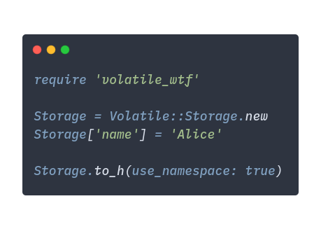

# VolatileWTF

[](https://badge.fury.io/rb/volatile_wtf)

A Ruby wrapper for [Volatile](https://volatile.wtf/), a key-value pair API that everyone can use.

More documentation at [RDoc](https://www.rubydoc.info/gems/volatile_wtf).

## Installation

```bash
gem install volatile_wtf
```

or for a Gemfile:

```ruby
gem 'volatile_wtf'
```

```bash
bundle install
```

## Usage

<p style="text-align: center">
  
</p>

### Initialize storage object

```ruby
Storage = Volatile::Storage.new
```

### Create a key-value pair

```ruby
Storage['user_name'] = 'Alice' # => 'Alice'
```

If you want to create a pair independent from your Storage:

```ruby
Storage.set('random_key', 'random_val')
```

You can use symbols as keys, but it is not recommended.

### Retrieve a value by key

```ruby
Storage['user_name'] # => 'Alice'
```

If you want to retrieve a value by a custom key independent from your Storage, use `Storage.get`:

```ruby
Storage.get('random_key') # => 'random_val'
```

### `created` and `modified` timestamps

[Volatile](https://volatile.wtf/) allows to get information about when a key-pair was created and modified.

- Created
  ```ruby
  Storage.created('user_name') # => 2019-11-12 16:55:45 +0300
  ```
- Modified

  ```ruby
  Storage.modified('user_name') # => 2019-11-12 17:40:45 +0300
  ```

### Namespaces

Namespace is used for distinguishing keys from different Storages.

#### Passing your own namespace

By default, Storage is initialized with a namespace equal to `SecureRandom.hex[0..5]` and makes keys look like `0123ab_some` instead of just `some`. You can pass your own value like this:

```ruby
Storage = Volatile::Storage.new('my_ns')
```

Or you can change namespace later:

```ruby
Storage.namespace = 'my_own_ns'
```

__Warning!__ You can loose links to previously stored data if you change a namespace.

#### Generating a namespaced key name

If you want to get a namespaced key name, you should use `Storage#namespaced_key`:

```ruby
Storage.namespaced_key('nice_key') # => '0123ab_nice_key'
```

Don't forget that every `Volatile::Storage.new` has its own namespace.

### Hash conversion (`#to_h`)

By default, `#to_h` generates a hash with friendly keys without a namespace:

```ruby
{
    "user_name" => "Alice",
        "email" => "alice@example.com"
}
```

To generate a hash with namespaced keys, use `use_namespace: true` parameter:

```ruby
Storage.to_h(use_namespace: true)
```

This will return the following result:

```ruby
{
    "2365fc_user_name" => "Alice",
        "2365fc_email" => "alice@example.com"
}
```

